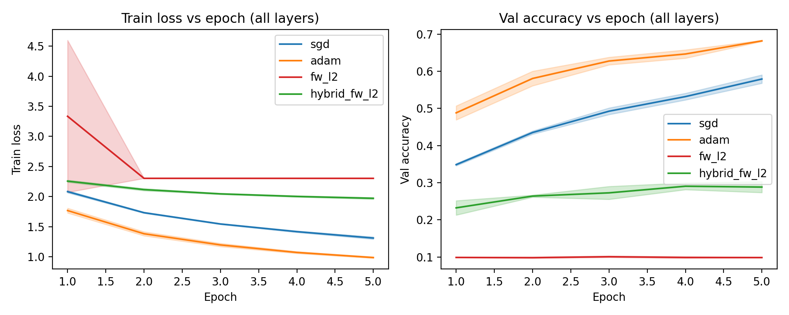
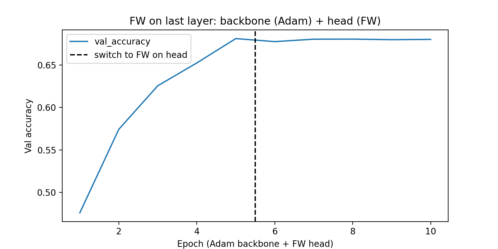
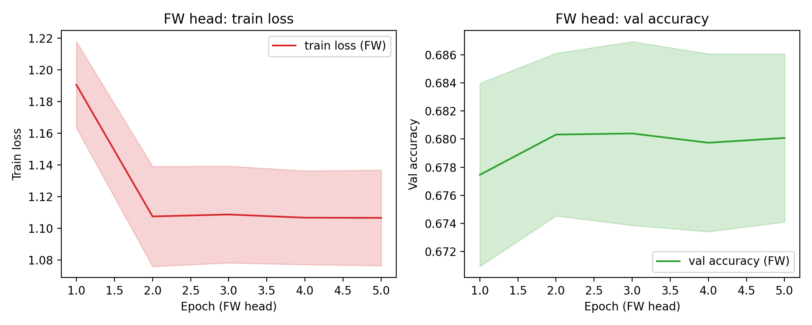
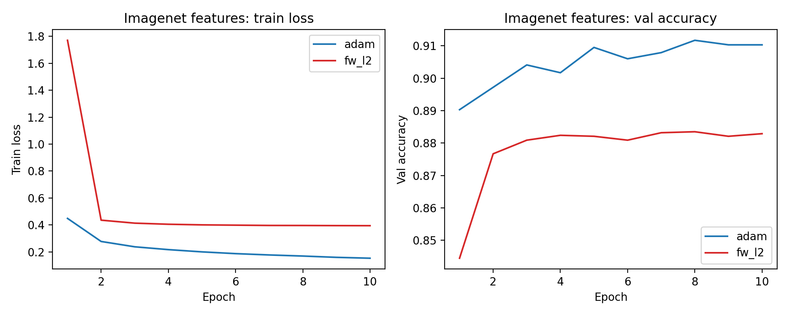

# frank-wolfe-lab

Исследовательский репозиторий про метод Франка–Вольфа (Conditional Gradient) в контексте глубокого обучения.

## Цель

Показать на живых примерах:

1. Где метод Франка–Вольфа работает естественно и эффективно  
   (линейные / логистические модели с L2‑ограничениями).
2. Что происходит, когда тот же подход наивно применяют к глубокой CNN.
3. Как гибридные и частичные варианты (FW только на head’е, FW+SGD) позволяют
   получить хоть какое‑то разумное обучение.

---

## Установка

```bash
git clone https://github.com/<user>/frank_wolfe_lab.git
cd frank_wolfe_lab

python -m venv .venv
source .venv/bin/activate  # Windows: .venv\Scripts\activate

pip install -e .
```

Требуется Python 3.10+ и TensorFlow 2.x.

---

## Структура

```text
src/
  fw_core/
    algorithms/
      frank_wolfe.py      # классический FW для выпуклой оптимизации (NumPy)
    types.py

  fw_tf/
    constraints.py        # множества S и линейные оракулы (L2/L∞-шары)
    optimizers.py         # FrankWolfeOptimizer, HybridFrankWolfeOptimizer
    model.py              # CNN для CIFAR-10, backbone + head
    data.py               # загрузка CIFAR-10, K-fold разбиение
    training.py           # эксперименты all_layers и fw_head
    imagenet_fw_head.py   # эксперименты c ResNet50 + линейный head
    experiments.py        # CLI для запуска экспериментов

results/
  *.json                  # истории метрик по эпохам
  *.png                   # сгенерированные графики

scripts/
  plot_results.py         # построение графиков из results/*.json
```

---

## Метрики

Во всех экспериментах логируются стандартные метрики Keras:

- `loss` — средний train loss (кросс‑энтропия по батчам).
- `val_loss` — кросс‑энтропия на валидации.
- `accuracy` — точность на обучении.
- `val_accuracy` — точность на валидации.

Интерпретация для 10 классов:

- `loss ≈ 2.3026`, `accuracy ≈ 0.1` — модель предсказывает
  почти равномерное распределение (случайное угадывание).
- Если `loss` убывает, а `val_accuracy` растёт от 0.1 к 0.6–0.7 —
  сеть реально чему‑то учится.
- В Imagenet‑кейсе `val_accuracy > 0.85` означает, что линейный head
  хорошо использует фичи предобученного ResNet50.

---

## Как запускать эксперименты и строить графики

1. CIFAR‑10, полная CNN и разные оптимизаторы:

```bash
python -m fw_tf.experiments --mode all_layers --epochs 5 --k_folds 3
```

2. CIFAR‑10, FW только на последнем слое:

```bash
python -m fw_tf.experiments --mode fw_head --k_folds 3
```

3. CIFAR‑10, ResNet50‑features + линейный head:

```bash
python -m fw_tf.experiments --mode imagenet --epochs 10
```

После этого:

```bash
python scripts/plot_results.py
```

Графики появятся в `results/`:

- `all_layers_curves.png`
- `fw_head_global_val_acc.png`
- `fw_head_fw_phase_curves.png`
- `imagenet_curves.png`

Ниже — интерпретация этих графиков.

---

## Результаты

### 1. Полная CNN на CIFAR‑10 (`all_layers_curves.png`)

График:



**Train loss vs epoch (слева)** и **Val accuracy vs epoch (справа)**  
для четырёх оптимизаторов:

- `sgd` — SGD + momentum,
- `adam` — Adam,
- `fw_l2` — Frank–Wolfe на L2‑шарах для всех весов,
- `hybrid_fw_l2` — гибрид: редкий FW‑шаг, в основном SGD.

Наблюдения:

- **SGD и Adam**:
  - train loss стабильно убывает;
  - val accuracy растёт примерно с 0.35 до 0.58 (SGD) и 0.68 (Adam) за 5 эпох.
- **Чистый FW (`fw_l2`)**:
  - train loss быстро приходит в плато около 2.3;
  - val accuracy за все эпохи остаётся ≈ 0.10 (чистое случайное угадывание).
- **Hybrid FW (`hybrid_fw_l2`)**:
  - train loss немного убывает с ~2.3 до ~2.0;
  - val accuracy растёт с ≈0.24 до ≈0.29 — это заметно лучше рандома,
    но существенно хуже SGD/Adam.

Вывод:

- На полной, глубоко **невыпуклой** CNN наивное применение
  FW‑оптимизатора на L2‑шарах для всех весов просто **не учит сеть**:
  алгоритм застревает возле решения «softmax ≈ uniform».
- Гибридный оптимизатор, где FW‑шаги редкие и доминирует SGD,
  уже способен обучаться, но остаётся сильно позади классических методов.

Это иллюстрирует ограниченность классического FW в глубоко невыпуклых моделях при жёстком ограничении всех весов одним и тем же L2‑шаром.

---

### 2. FW только на последнем слое CNN (`fw_head_global_val_acc.png`, `fw_head_fw_phase_curves.png`)

Глобальная кривая:



Сначала 5 эпох обучаем всю CNN Adam’ом (`epochs 1–5`), затем замораживаем
backbone и ещё 5 эпох тренируем **только последний Dense‑слой** методом
Франка–Вольфа (`epochs 6–10`).

Наблюдения:

- Adam выводит модель примерно к `val_accuracy ≈ 0.68`.
- После переключения на FW для head’а качество **не разваливается**:
  валид. точность остаётся в узком коридоре вокруг ~0.68–0.69.

Детально FW‑фаза:



Слева — train loss, справа — val accuracy для FW‑фазы,
усреднённые по фолдам (заштрихованная область — разброс по фолдам).

- Train loss чуть снижается и выходит на плато.
- Val accuracy колеблется вокруг исходного уровня (~0.68), без систематического
  ухудшения.

Вывод:

- Если применять FW **аккуратно** и только к верхнему слою над уже
  выученным backbone, метод может работать как мягкий регуляризатор,
  не разрушая уже достигнутое качество.
- Это ближе к классическому использованию FW для «ограниченной»
  линейной/логистической регрессии.

---

### 3. Imagenet‑фичи + линейный head (`imagenet_curves.png`)

График:



Здесь:

- фиксированный предобученный ResNet50 → фичи CIFAR‑10;
- над ними обучается **линейный** классификатор (Dense + softmax):
  - Adam,
  - FW(L2‑шар, умеренный радиус, затухающий шаг).

Наблюдения:

- **Train loss**:
  - у Adam стартует ~0.45 и убывает до ~0.15;
  - у FW стартует выше (~1.8 из‑за жёсткого ограничения), но быстро
    падает до ~0.4 и затем стабилизируется.
- **Val accuracy**:
  - Adam быстро выходит к ~0.90–0.91;
  - FW растёт до ~0.88–0.883 и тоже выходит на плато.

Вывод:

- В этом почти‑выпуклом кейсе (линейный head + L2‑ограничение)
  Frank–Wolfe ведёт себя **ожидаемо и вполне конкурентоспособно**:
  качество немного ниже Adam, но существенно выше рандома и весьма
  пригодно для практики.
- Это соответствует теоретическим ожиданиям от FW в задачах
  типа логистической регрессии с L2‑ограничением: проекций нет, есть
  линейный оракул по шару.

---

## Краткое резюме

- **Где FW уместен**:
  - линейные / логистические модели над хорошими фичами,
  - задачи с естественными L2‑ограничениями (`||w||_2 ≤ R`),
  - когда важна проекционно‑свободная оптимизация или особая геометрия.

- **Где FW страдает**:
  - полное обучение глубокой CNN на CIFAR‑10 с одним L2‑шаром
    для всех весов:
    - чистый FW фактически не учится,
    - гибридные схемы требуют доминирующего SGD/Adam.

- **Компромисс**:
  - FW на последнем слое (head) поверх уже выученного backbone —
    рабочий вариант, который можно рассматривать как геометрическую
    регуляризацию/ограничение на классификатор.

---

## TODO / идеи для развития

- Разные множества S и радиусы для разных слоёв (per‑layer/per‑tensor FW).
- Возможности моделей с away‑steps, pairwise FW, stochastic FW.
- PyTorch‑реализация тех же экспериментов.
- Больше синтетических выпуклых задач в `fw_core` с красивыми демонстрациями
  dual gap и теоретических скоростей сходимости.

---

## Лицензия

См. файл `LICENSE`.


[My experiments with the FW optimizer](https://colab.research.google.com/drive/1Z5iwvlKk-vND6rPzmVh5WklLut_frFRd?usp=sharing)